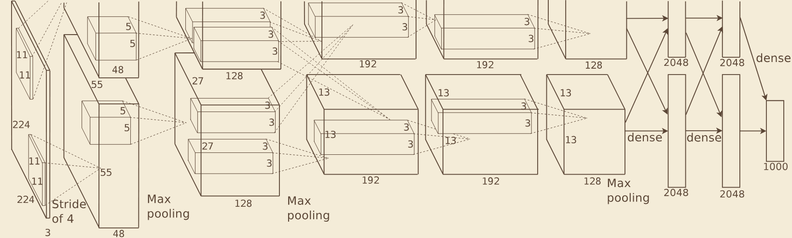
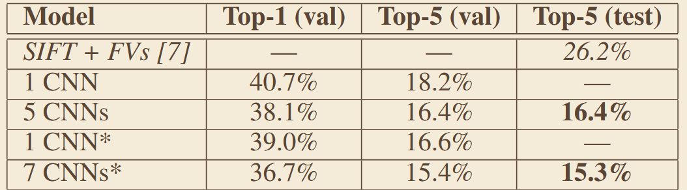

# 《ImageNet Classification with Deep Convolutional Neural Networks》
## 一、abstract
针对大规模图像分类中深层 CNN 训练困难、易过拟合、精度远低于传统方法的问题，首次引入 ReLU 激活、双 GPU 并行、Dropout、重叠池化等技术，在 ImageNet 2012 上实现远超传统方法的分类精度。
## 二、核心图、公式
### 1、网络架构

### ReLU
 if x > 0 , f(x) = x ; or f(x) = 0

## 三、关键实验数据
