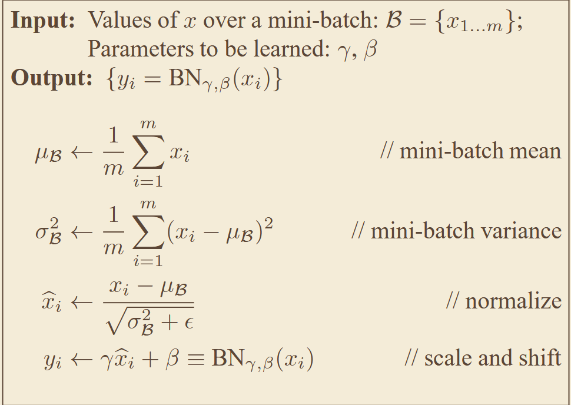
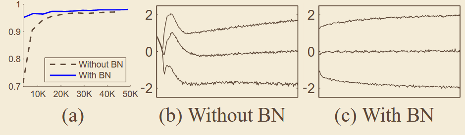

# 《Batch Normalization: Accelerating Deep Network Training by Reducing Internal Covariate Shift》
## 一、abstract
针对深层网络训练中内部协变量偏移（ICS）导致的梯度消失 / 爆炸、收敛速度慢的问题，对每个批次的特征做归一化，并引入可学习的缩放与偏移参数，在不损失网络表达能力的前提下大幅加速训练、提升精度与泛化性。
## 二、核心图、公式
### 1、算法架构

## 三、关键实验数据
