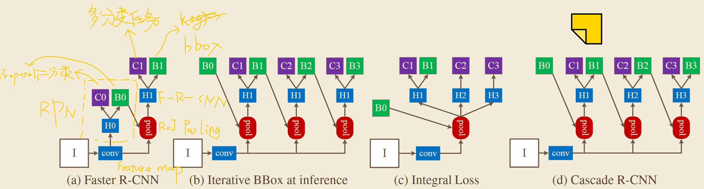
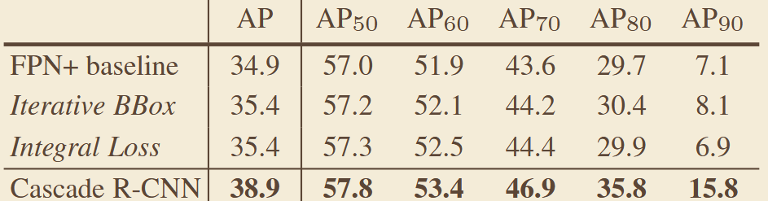

# 《Cascade R-CNN: Delving into High Quality Object Detection》
## 一、abstract
针对单检测头存在的 IoU 阈值两难问题（阈值高易过拟合、阈值低输出大量低质量框），提出级联检测架构，通过多个检测头逐步提升 IoU 阈值，递进式优化检测框质量，显著提升高精度指标下的检测性能。
## 二、网络架构

## 三、关键实验数据
