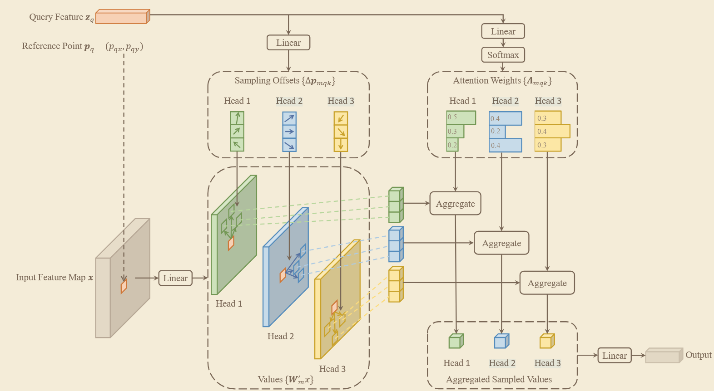
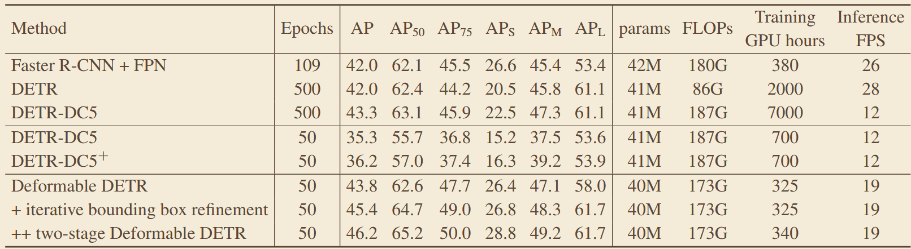

# 《DEFORMABLE DETR: DEFORMABLE TRANSFORMERS FOR END-TO-END OBJECT DETECTION》
## 一、abstract
针对 DETR 收敛慢、小目标差、全局注意力计算量大的问题，提出可变形注意力机制，仅关注少量自适应参考点，替代全局注意力，同时引入多尺度特征融合，大幅加快收敛速度并提升小目标检测性能。
### 1、网络架构

## 三、关键实验数据
