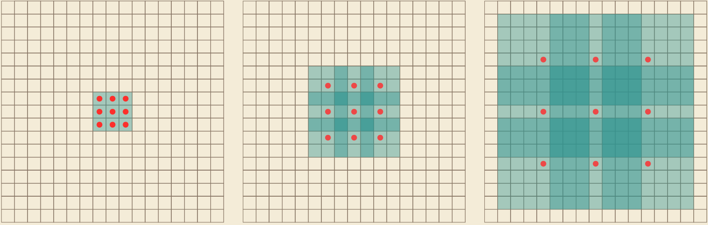
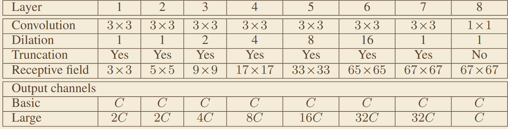
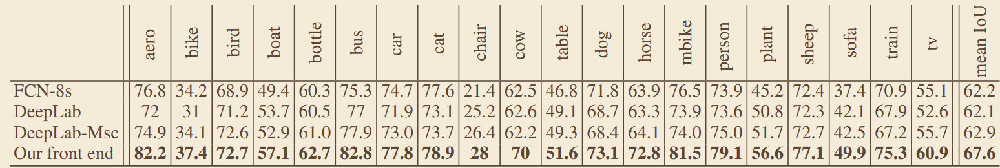

# 《Multi-Scale Context Aggregation by Dilated Convolutions》
## 一、abstract
针对 ResNet 仅靠深度提升性能收益递减、参数量与计算量膨胀过快的问题，提出聚合残差变换结构，在残差块中引入分组卷积，新增基数（Cardinality）维度，在不显著增加参数量与计算量的前提下提升模型精度。
## 二、网络架构
### 1、卷积核结构：

### 2、net 结构：

## 三、关键实验数据
