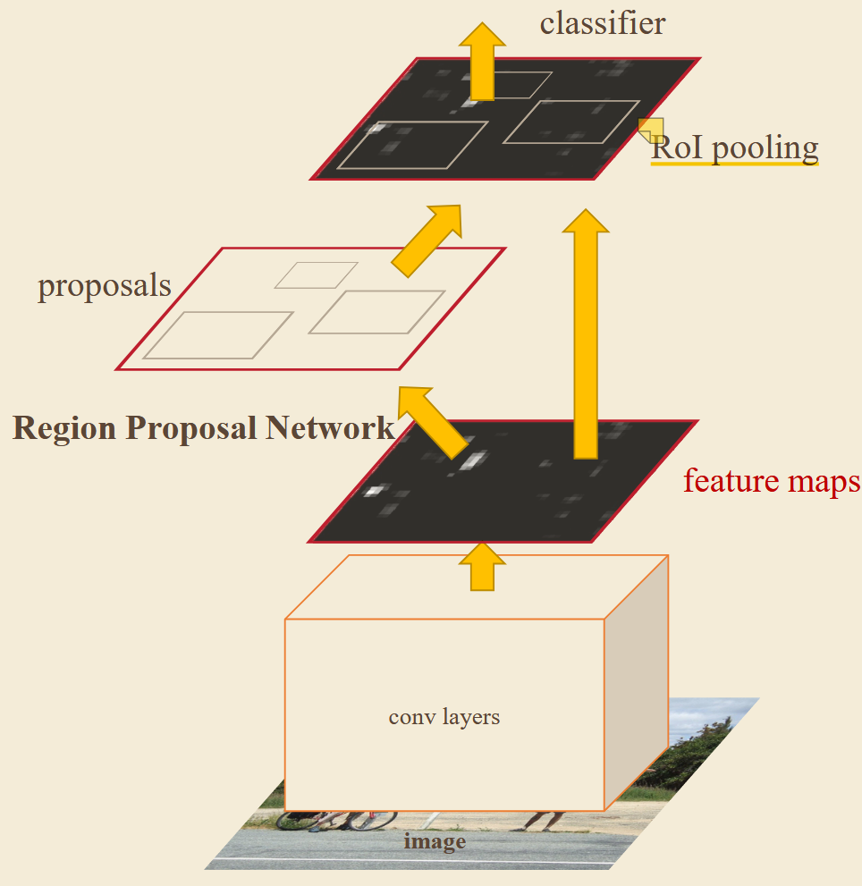
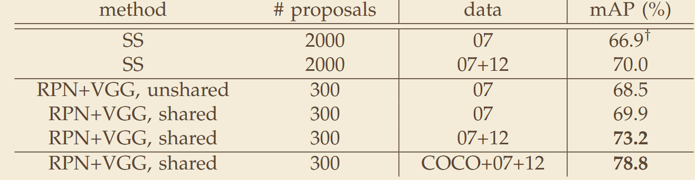

# 《Faster R-CNN: Towards Real-Time Object Detection with Region Proposal Networks》
## 一、abstract
针对 Fast R-CNN 中选择性搜索生成候选框速度慢、无法共享卷积特征的问题，提出区域候选网络（RPN），与检测网络共享全图卷积特征，实现端到端联合训练，在大幅提升检测速度的同时保证检测精度，奠定了两阶段检测的标准范式。
## 二、网络架构

## 三、关键实验数据
