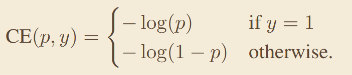
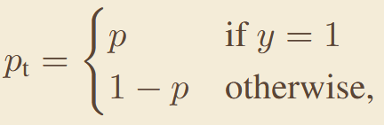
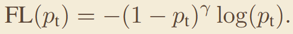
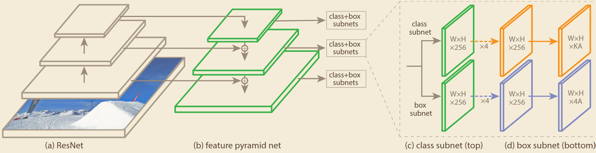
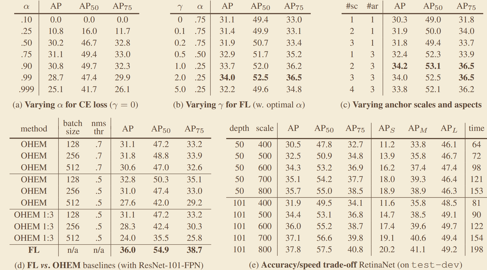

# 《Focal Loss for Dense Object Detection》
## 一、abstract
针对一阶段密集检测中正负样本极度不平衡、大量简单负样本主导损失并淹没正样本梯度的问题，提出焦点损失，通过调制因子降低简单样本权重，让模型聚焦难例学习，使一阶段检测精度首次追平两阶段方法。
## 二、Focal Loss

## 三、网络架构
#### 以FPN的理念创新：

## 四、关键实验数据
