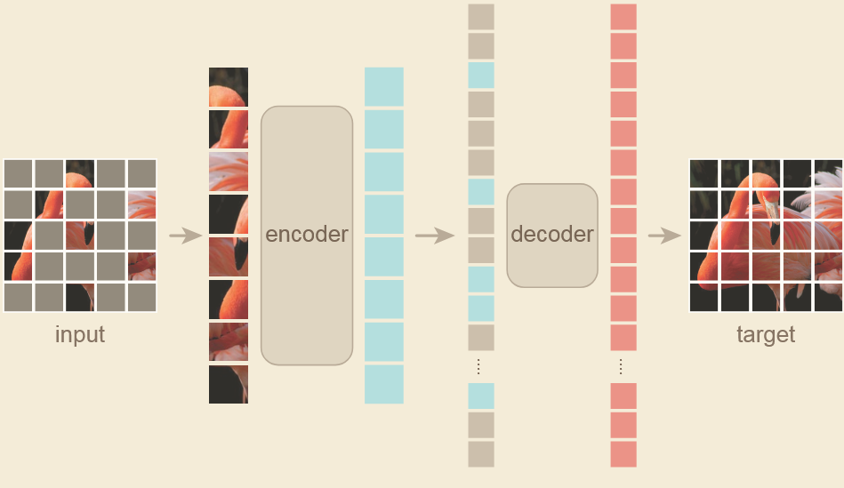
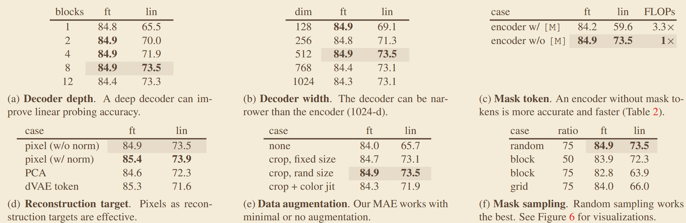

# 《Masked Autoencoders Are Scalable Vision Learners》
## 一、abstract
提出掩码自编码器的视觉自监督预训练范式，随机掩码高比例图像 patch，非对称编解码器仅从可见 patch 重建原始图像，证明 CV 中掩码预训练可达到 NLP 中 BERT 的效果，大幅提升预训练效率与下游任务性能。
### 1、网络架构

## 三、关键实验数据
