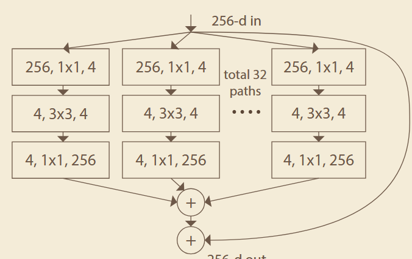
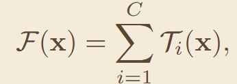
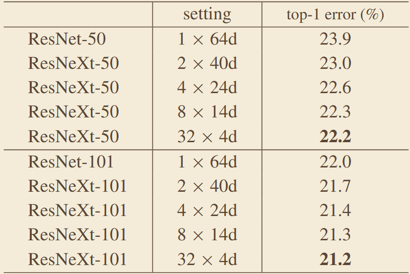
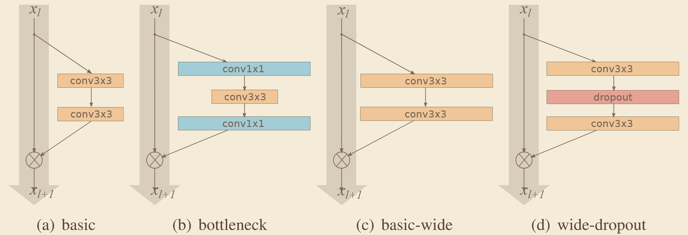
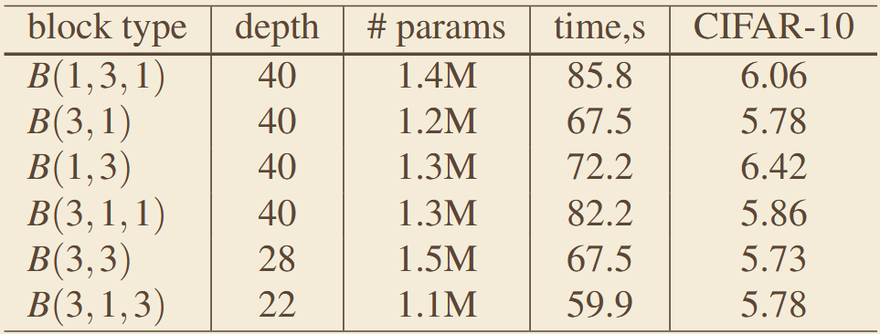

# 《Aggregated Residual Transformations for Deep Neural Networks》
## 一、abstract
针对 ResNet 仅靠深度提升性能收益递减、参数量与计算量膨胀过快的问题，提出聚合残差变换结构，在残差块中引入分组卷积，新增基数（Cardinality）维度，在不显著增加参数量与计算量的前提下提升模型精度。
## 二、网络架构

### 1、核心公式：
#### 映射：

## 三、消融实验数据

# 《Wide Residual Networks》
## 一、abstract
针对 ResNet 深度过深导致的梯度流通效率低、训练速度慢、深层特征复用率低的问题，提出减少网络深度、增加通道宽度的宽残差网络，在显著提升训练速度的同时获得优于深层 ResNet 的精度。
## 二、网络架构

## 三、关键实验数据
