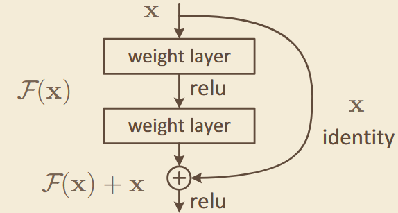
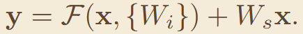
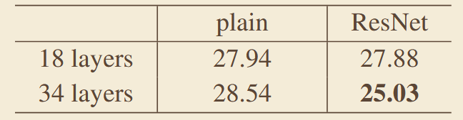

# 《Deep Residual Learning for Image Recognition》
## 一、abstract
针对深层神经网络的退化问题（网络加深后精度先饱和后快速下降），提出残差学习框架，通过 shortcut 短路连接让网络学习残差映射而非原始映射，训练出深度网络，大幅提升图像分类与检测精度。
### 1、网络架构

### 1、核心公式：
#### 残差映射：

## 三、关键实验数据
