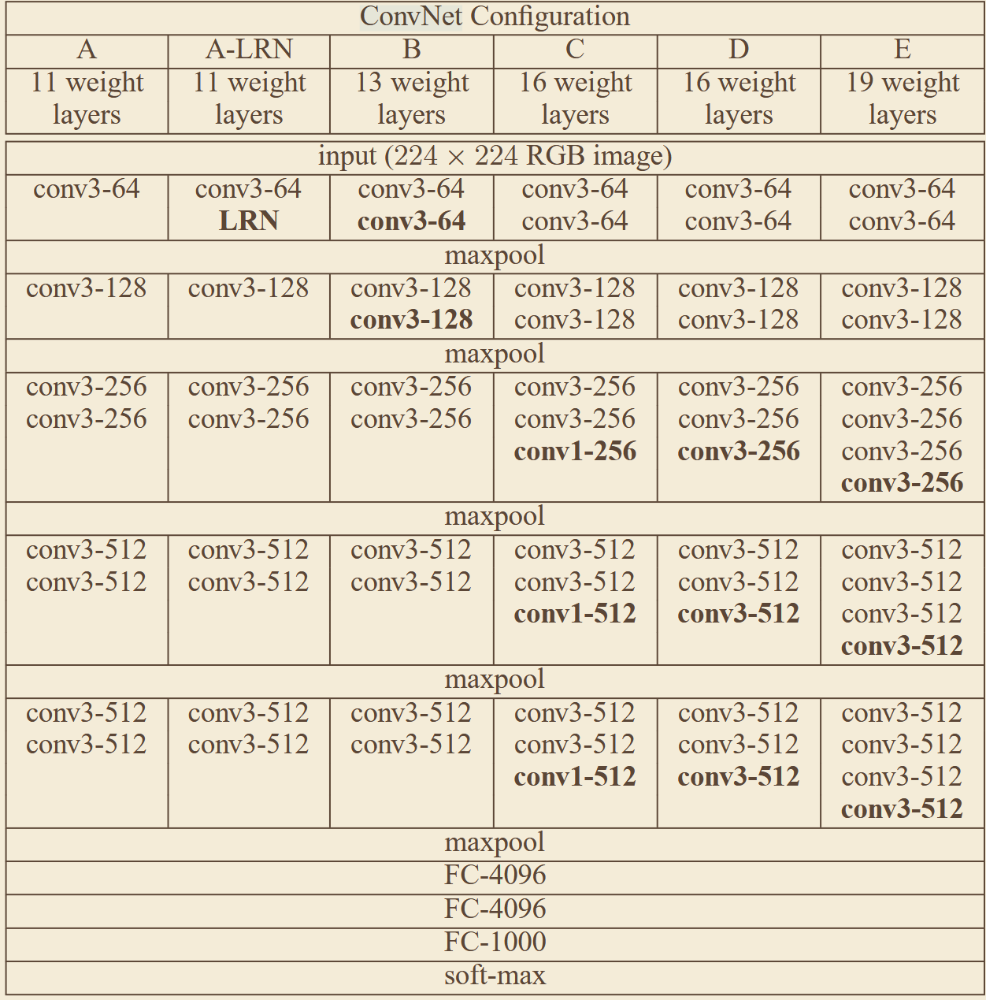
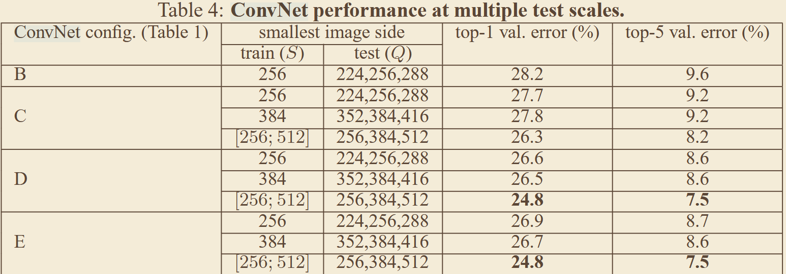

# 《Very Deep Convolutional Networks for Large-Scale Image Recognition》
## 一、abstract
针对早期卷积网络架构设计混乱、深度对性能的影响不明确的问题，采用统一的 3×3 小卷积核堆叠构建 11~19 层深度网络，严格证明网络深度是提升特征提取能力的核心因素，奠定了现代 CNN 的基础架构范式。
## 二、核心图、公式
### 1、网络架构

## 三、关键实验数据
