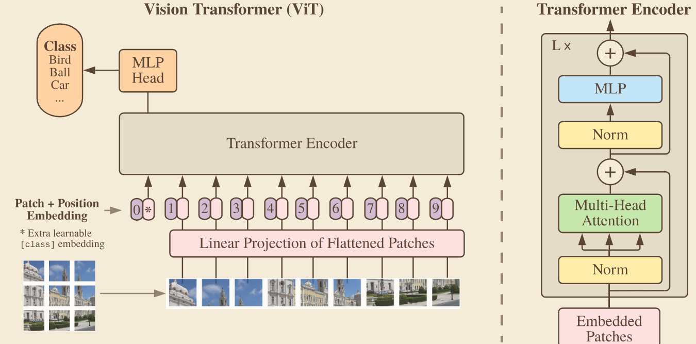
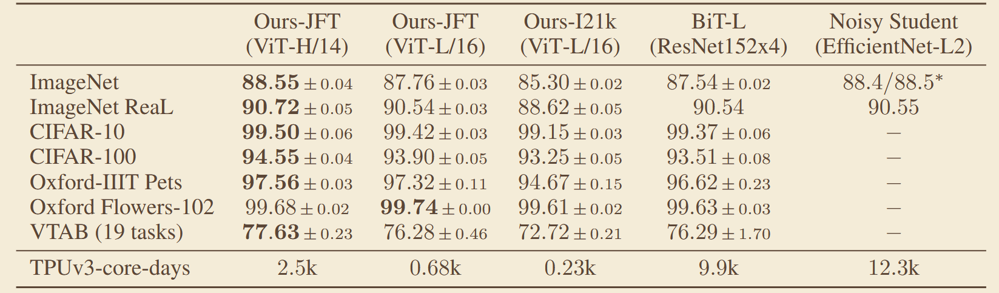

# 《AN IMAGE IS WORTH 16X16 WORDS: TRANSFORMERS FOR IMAGE RECOGNITION AT SCALE》
## 一、abstract
首次将纯 Transformer 架构引入图像分类任务，将图像切分为固定大小的 patch 序列，通过自注意力建模全局关系，证明在大规模数据预训练下，纯视觉 Transformer 可以超越经典 CNN。
### 1、网络架构

## 三、关键实验数据
