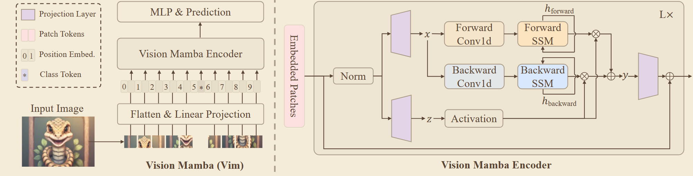
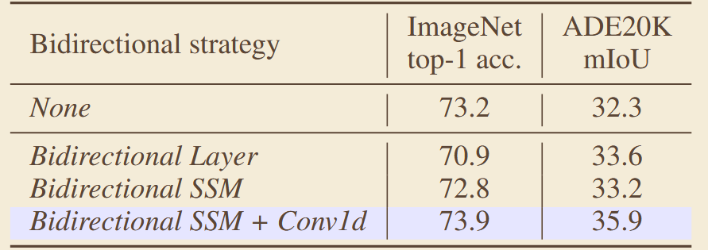
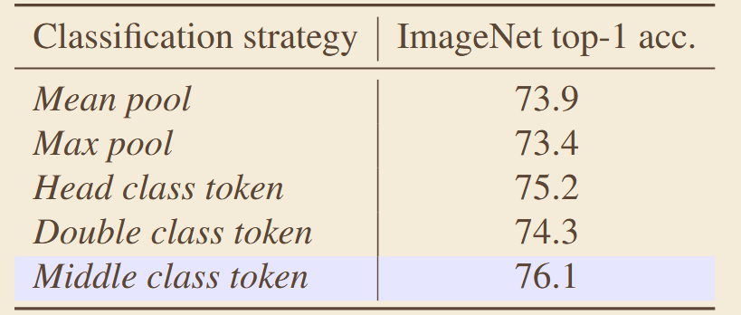

# 《Vision Mamba: Efficient Visual Representation Learning with Bidirectional  State Space Model》
## 一、abstract
将 Mamba 架构适配到视觉任务，提出双向状态空间扫描机制，用线性复杂度的 Mamba 层替代 ViT 中的自注意力，在保证分类精度的前提下显著提升推理速度，尤其是高分辨率输入场景优势更明显。
### 1、网络架构

## 三、关键实验数据

