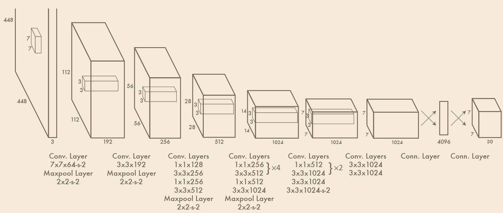
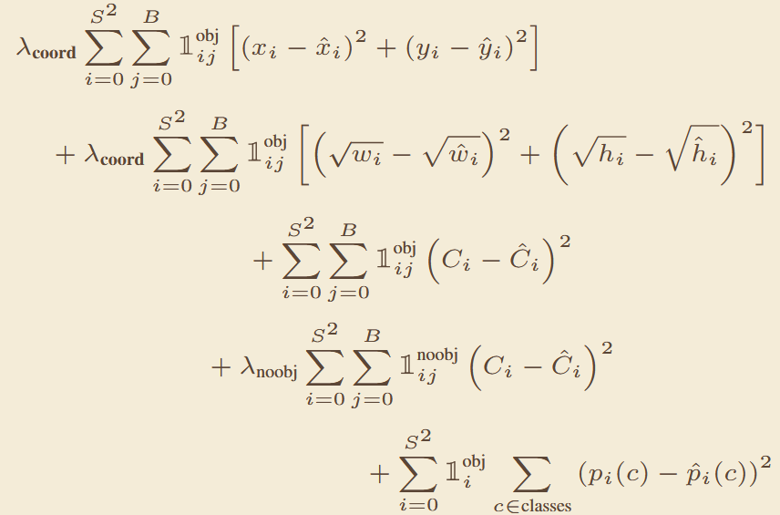
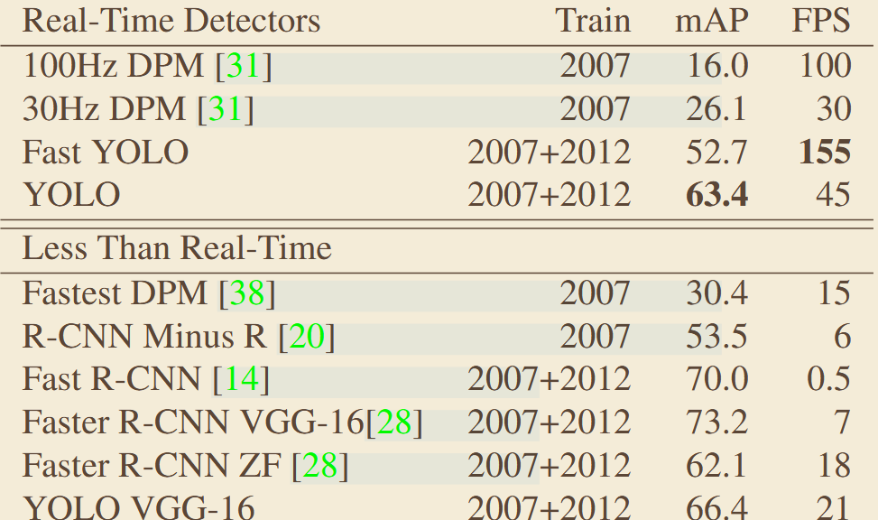

# 《You Only Look Once: Unified, Real-Time Object Detection》
## 一、abstract
针对两阶段检测速度慢、流程割裂的问题，将目标检测转化为单阶段回归问题，单个神经网络直接从原图像素预测边界框与类别概率，实现端到端的实时目标检测，开创了一阶段检测的研究方向。
## 二、网络架构

## 三、Loss def

## 四、关键实验数据

## 五、我的思考
### 局限性：
每个网格只能预测同一类目标，密集小目标检测能力差；定位精度远低于两阶段方法，召回率偏低；损失函数中大小框权重相同，小框误差对损失影响被弱化。
### 边界条件：
适用于对速度要求极高、精度要求适中的实时检测场景；适合目标稀疏、尺度变化小的场景。
### 消融实验逻辑：
控制变量测试不同网格数S、每个网格预测框数B对精度速度的影响；对比不同损失函数权重配置，验证坐标损失加权的必要性；同时与两阶段方法做速度 - 精度全面对比，明确实时检测的定位。