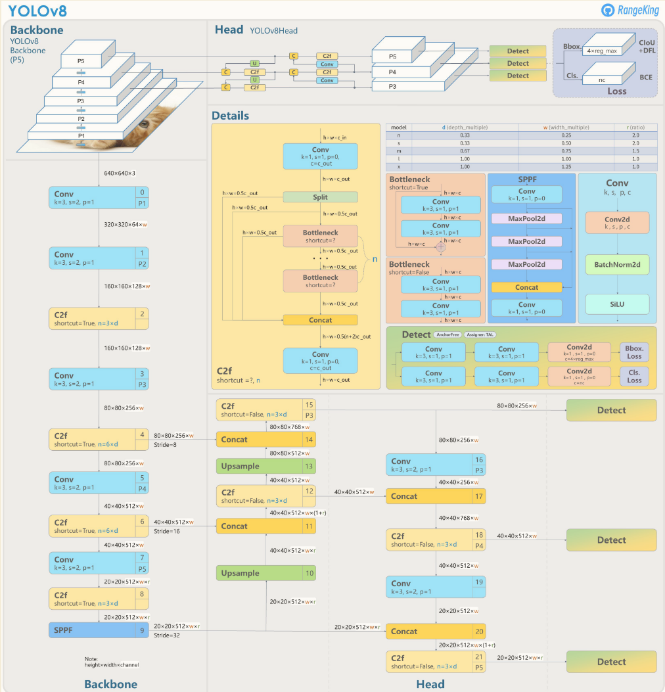
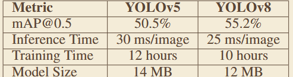

# 《WHAT IS YOLOV8: AN IN-DEPTH EXPLORATION OF THE INTERNAL FEATURES OF THE NEXT-GENERATION OBJECT  DETECTOR》
## 一、abstract
整合 CSPDarknetv8 骨干、C2f 模块、PAN-FPN 颈部、解耦检测头、Anchor-Free 范式、动态标签分配等技术，实现了检测精度与推理速度的最优平衡，同时支持检测、分割、分类、姿态等多任务。
## 二、网络架构

## 三、关键实验数据
