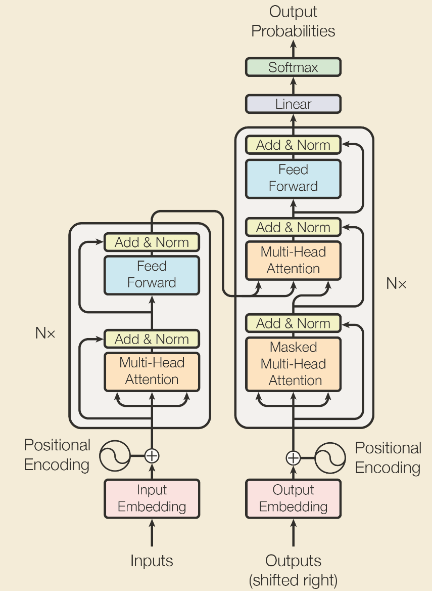
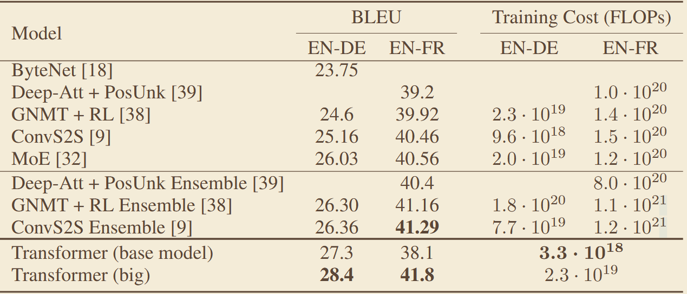

# 《Attention is All You Need》
## 一、abstract
针对 RNN 系列模型无法并行计算、长距离依赖建模能力弱的问题，提出纯注意力机制的 Transformer 架构，完全基于多头自注意力与前馈网络，实现序列并行训练与高效长距离建模，奠定了大语言模型与视觉大模型的基础架构。
## 二、网络架构

## 三、关键实验数据

## 四、我的思考
### 局限性：
自注意力计算复杂度为序列长度的平方，长序列下显存与算力开销剧增；缺乏局部归纳偏置，小数据集上易过拟合；绝对位置编码对序列长度外推能力差。
### 边界条件：
是当前 NLP、CV、多模态大模型的通用基座架构，在大数据、大算力场景下优势最大化；适合需要长距离依赖建模的任务。
### 消融实验：
逐一验证多头注意力、残差连接、层归一化、Dropout 等组件的作用；对比不同注意力头数、模型深度宽度的性能；测试不同位置编码方案，验证正弦位置编码的效果。
