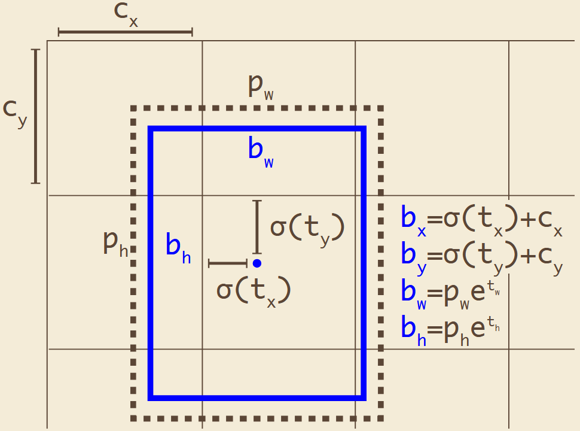
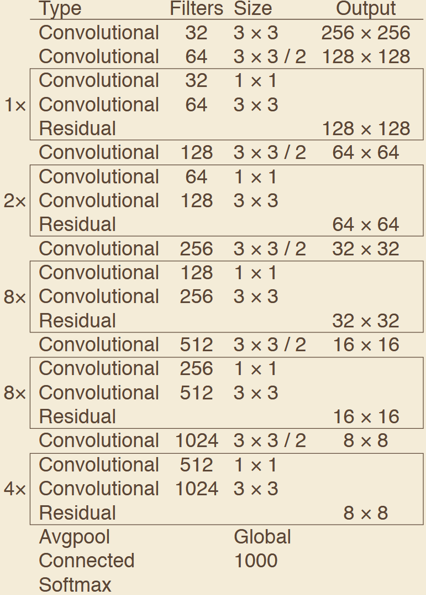
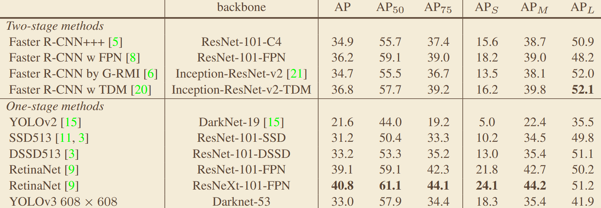

# 《YOLOv3: An Incremental Improvement》
## 一、abstract
针对 YOLOv1/v2 定位不准、小目标检测差、精度不足的问题，引入 Darknet-53 骨干、多尺度特征金字塔预测、Anchor 聚类、二元交叉熵多标签分类，在保持实时速度的前提下大幅提升检测精度，成为工业界最经典的实时检测基线。
## 二、Bounding boxes

## 三、Darknet-53

## 四、关键实验数据
